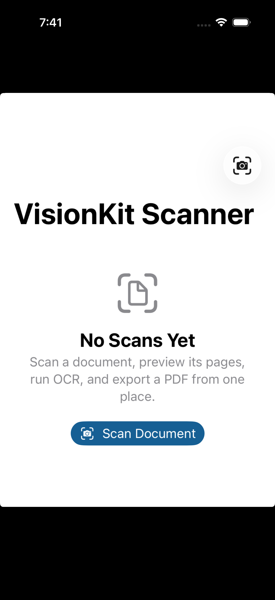
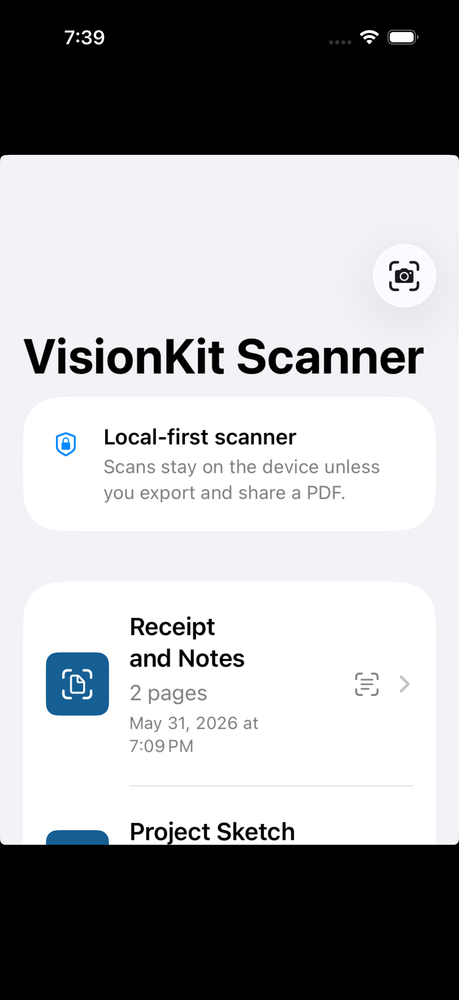
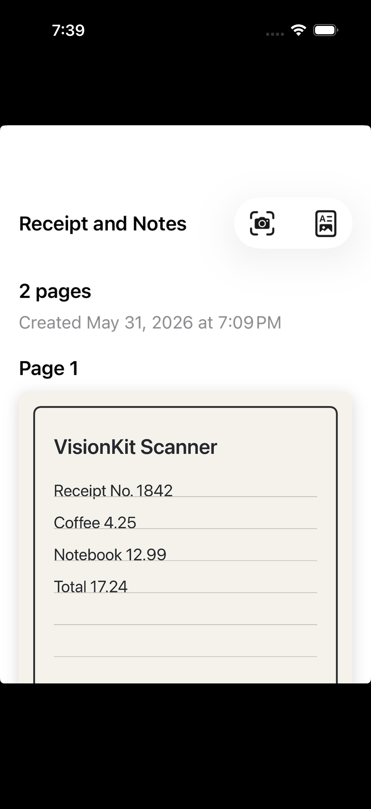
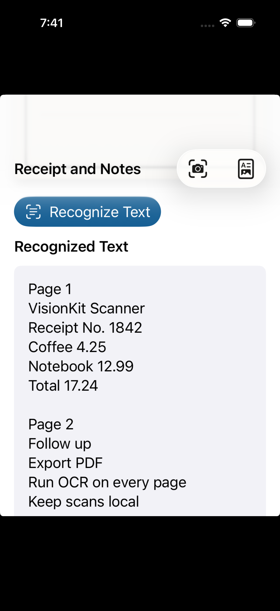

# VisionKit Scanner

A SwiftUI iOS document scanner inspired by the article "I Finally Tried Apple VisionKit: Building a Simple Document Scanner in SwiftUI".

The project turns the article into a working app foundation. It uses VisionKit for document capture, SwiftUI for the interface, MVVM for scanner state, Vision for OCR, and UIKit PDF rendering for export.

## Screenshots

| Empty state | Scanned documents |
| --- | --- |
|  |  |

| Page preview | OCR results |
| --- | --- |
|  |  |

The native VisionKit camera sheet is not shown in these screenshots because `VNDocumentCameraViewController` requires camera hardware and should be tested on a real iPhone or iPad.

## What The App Does

- Presents Apple's document scanner with `VNDocumentCameraViewController`
- Wraps the UIKit scanner in SwiftUI using `UIViewControllerRepresentable`
- Stores scanned documents in a `ScannerViewModel`
- Shows a local-first scan list
- Previews every scanned page
- Runs OCR across all scanned pages with `VNRecognizeTextRequest`
- Displays recognized text with text selection enabled
- Exports scanned pages as a PDF through `ShareLink`

## App Flow

1. The user opens the app and taps **Scan Document**.
2. `DocumentScannerView` presents the VisionKit document camera.
3. VisionKit returns a `VNDocumentCameraScan`.
4. The coordinator converts each scanned page into a `UIImage`.
5. `ScannerViewModel` creates a `ScannedDocument`.
6. The scan appears in the list.
7. The detail screen previews pages, runs OCR, and can create a PDF.

## Project Structure

```text
VisionKitScanner/
  Models/
    ScannedDocument.swift
  Services/
    PDFExporter.swift
    TextRecognizer.swift
  Supporting/
    Assets.xcassets/
    DemoData.swift
    Info.plist
  ViewModels/
    ScannerViewModel.swift
  Views/
    ContentView.swift
    DocumentScannerView.swift
    ScanDetailView.swift
  VisionKitScannerApp.swift
```

## Important Files

`DocumentScannerView.swift`

Wraps `VNDocumentCameraViewController` so it can be presented from SwiftUI. The coordinator handles success, cancel, and error callbacks.

`ScannerViewModel.swift`

Owns scanner presentation state and the scanned document collection. This keeps the main SwiftUI view focused on rendering.

`TextRecognizer.swift`

Uses Vision's `VNRecognizeTextRequest` to extract text from scanned page images.

`PDFExporter.swift`

Creates a temporary PDF from scanned page images so the user can share or save the result.

`Info.plist`

Includes `NSCameraUsageDescription`, which is required before presenting the document camera.

## Requirements

- Xcode 16 or newer
- iOS 17 or newer
- A real iPhone or iPad for document scanning

The app builds in the simulator, but the actual document scanner experience depends on camera hardware.

## Running The App

Open the project in Xcode:

```bash
open VisionKitScanner.xcodeproj
```

Then choose a physical iOS device and run the `VisionKitScanner` scheme.

You can also build from the command line:

```bash
DEVELOPER_DIR=/Applications/Xcode.app/Contents/Developer \
xcodebuild \
  -project VisionKitScanner.xcodeproj \
  -scheme VisionKitScanner \
  -destination 'generic/platform=iOS Simulator' \
  CODE_SIGNING_ALLOWED=NO \
  build
```

## Screenshot Demo Mode

The app includes launch arguments used only to make README screenshots repeatable in the simulator:

- `--demo-data` loads sample scanned documents into the list
- `--demo-detail` opens the sample scan detail screen
- `--demo-ocr` opens the detail screen and scrolls to recognized text

Normal launches do not load sample documents.

## Privacy Notes

This sample keeps scanned pages and OCR text in memory. It does not upload documents to a server. A document only leaves the app when the user exports and shares a PDF.

For a production scanner, you would likely add persistent storage, explicit delete flows, file protection, and clearer onboarding around where scanned documents are stored.

## Possible Next Features

- Save scans locally with SwiftData or file storage
- Rename documents
- Delete individual pages
- OCR every page automatically after scanning
- Search recognized text
- Add folders and tags
- Export multi-page PDFs with metadata
- Add iCloud sync
- Add a share extension
